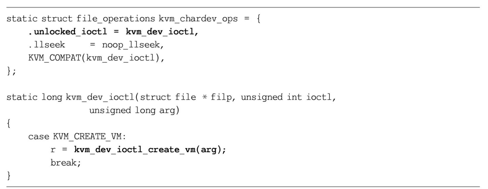
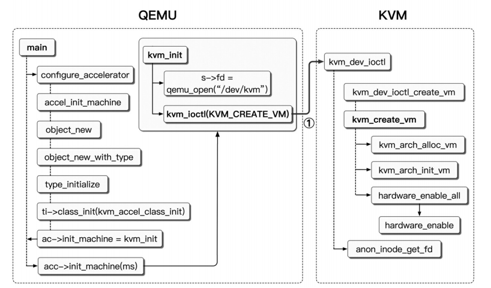

# 0. KVM模块初始化

初始化：

1. **架构相关初始化**
2. 回调函数设置、资源分配、**设备注册**

kvm的初始化，在`kvm_init`中完成，既包含了体系结构相关的初始化设置，也包含了各类回调函数的设置，资源分配，以及设备注册等，只有当初始化完成后，才能响应各类请求，比如创建虚拟机等；

1. 回调函数设置：`cpuhp_setup_state_nocall`与CPU的热插拔相关，`register_reboot_notifer`与系统的重启相关，`register_syscore_ops`与系统的休眠唤醒相关，而这几个模块的回调函数，最终都会去调用体系结构相关的函数去打开或关闭`Hypervisor`；
2. 资源分配：`kmem_cache_create_usercopy`与`kvm_async_pf_init`都是创建`slab缓存`，用于内核对象的分配；
3. `kvm_vfio_ops_init`：`VFIO`是一个可以安全将设备`I/O`、中断、DMA导出到用户空间的框架，（IO虚拟化）；

`misc_register`：注册字符设备，在`kvm_init`函数中调用此函数完成注册，以便上层应用程序来使用`kvm模块`。

注册成功后会在/dev/目录下产生名为kvm的设备节点，即/dev/kvm。该设备文件对应的fd（文件描述符）的file_operations为kvm_chardev_ops。该设备仅支持ioctl系统调用，其中最重要的便是KVM_CREATE_VM ioctl。KVM模块接收该系统调用时将会创建虚拟机。kvm_chardev_ops定义及具体代码：

- 字符设备的注册分为三级，分别代表`kvm`, `vm`, `vcpu`，上层最终使用底层的服务都是通过`ioctl`函数来操作；
- `kvm`：代表kvm内核模块，可以通过`kvm_dev_ioctl`来管理kvm版本信息，以及vm的创建等；
- `vm`：虚拟机实例，可以通过`kvm_vm_ioctl`函数来创建`vcpu`，设置内存区间，分配中断等；
- `vcpu`：代表虚拟的CPU，可以通过`kvm_vcpu_ioctl`来启动或暂停CPU的运行，设置vcpu的寄存器等；

以`Qemu`的使用为例：

1. 打开`/dev/kvm`设备文件；
2. `ioctl(xx, KVM_CREATE_VM, xx)`创建虚拟机对象；
3. `ioctl(xx, KVM_CREATE_VCPU, xx)`为虚拟机创建vcpu对象；
4. `ioctl(xx, KVM_RUN, xx)`让vcpu运行起来；

# 1. CPU虚拟化

## 1.1 CPU虚拟化过程：

https://www.cnblogs.com/LoyenWang/p/13796537.html

当QEMU启动时，首先会解析用户传入的命令行参数，确定创建的虚拟机类型（通过QEMU-machine参数指定）与CPU类型（通过QEMU-cpu参数指定），并创建相应的机器模型和CPU模型。而后QEMU打开KVM模块设备文件并发起KVM_CREATE_VM ioctl，请求KVM创建一个虚拟机。KVM创建虚拟机相应的结构体并为QEMU返回一个虚拟机文件描述符。QEMU通过虚拟机文件描述符发起KVM_CREATE_VCPU ioctl，请求KVM创建vCPU。与创建虚拟机流程类似，KVM创建vCPU相应的结构体并初始化，返回一个vCPU文件描述符。

QEMU通过vCPU文件描述符发起KVM_RUN ioctl，vCPU线程执行VMLAUNCH指令进入非根模式，执行虚拟机代码直至发生VMExit。(待定)

虚拟机创建 --> vcpu创建  --> vcpu运行

1. QEMU根据用户传入的命令行参数，确定创建的虚拟机类型（通过QEMU-machine参数指定）与CPU类型（通过QEMU-cpu参数指定），并创建相应的机器模型和CPU模型。
2. QEMU打开KVM模块设备文件（/dev/kvm）并发起KVM_CREATE_VM ioctl，请求KVM创建一个虚拟机。KVM创建虚拟机相应的结构体并为QEMU返回一个虚拟机文件描述符。（**虚拟机创建**）。
3. QEMU通过虚拟机文件描述符发起KVM_CREATE_VCPU ioctl，请求KVM创建vCPU。与创建虚拟机流程类似，KVM创建vCPU相应的结构体并初始化，返回一个vCPU文件描述符。（VCPU创建）
4. QEMU通过vCPU文件描述符发起KVM_RUN ioctl，vcpu线程进入guest模式执行虚拟机的非I/O代码，直至异常退出到kernel模式。

其涉及的代码可参考下图：

## 1.2 虚拟机创建

QEMU/KVM虚拟机创建的函数调用流程如下图。注意此处的`kvm_init`非kvm模块初始化中的`kvm_init`

